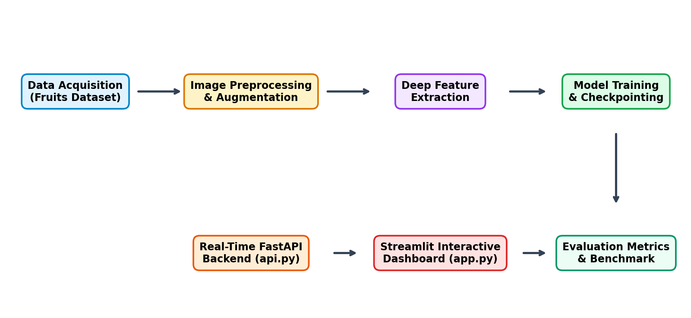
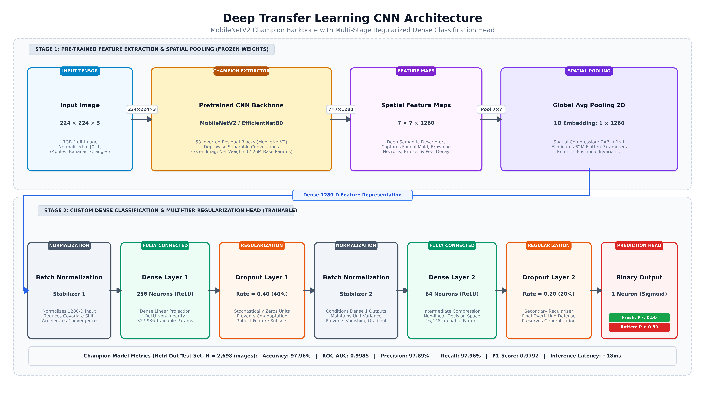
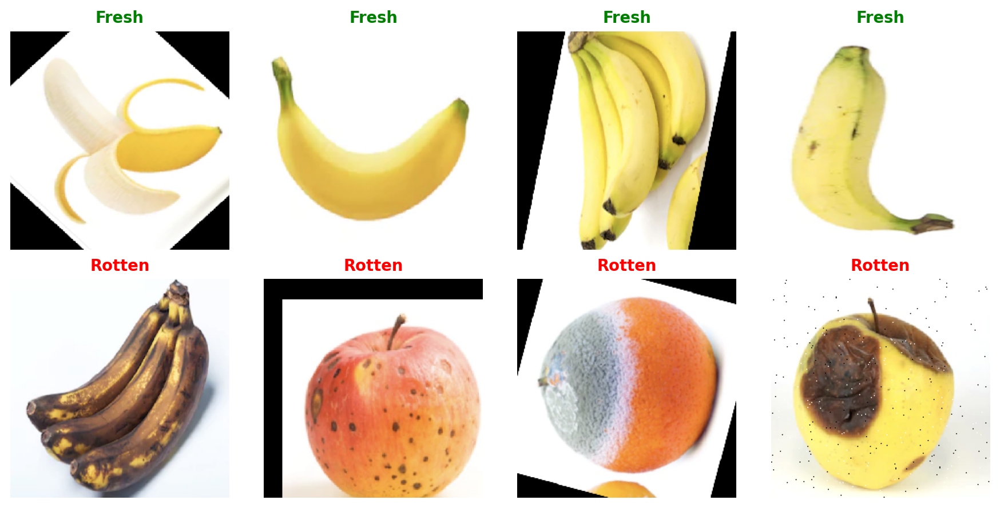
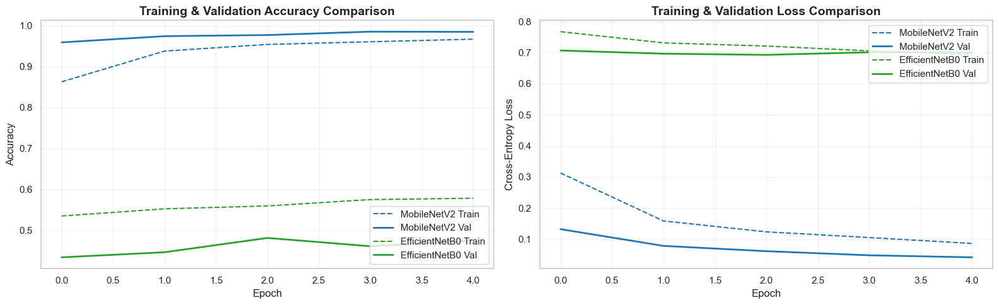
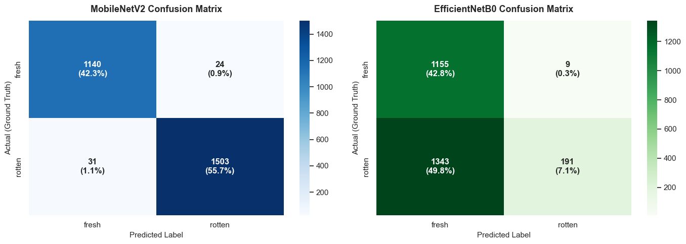
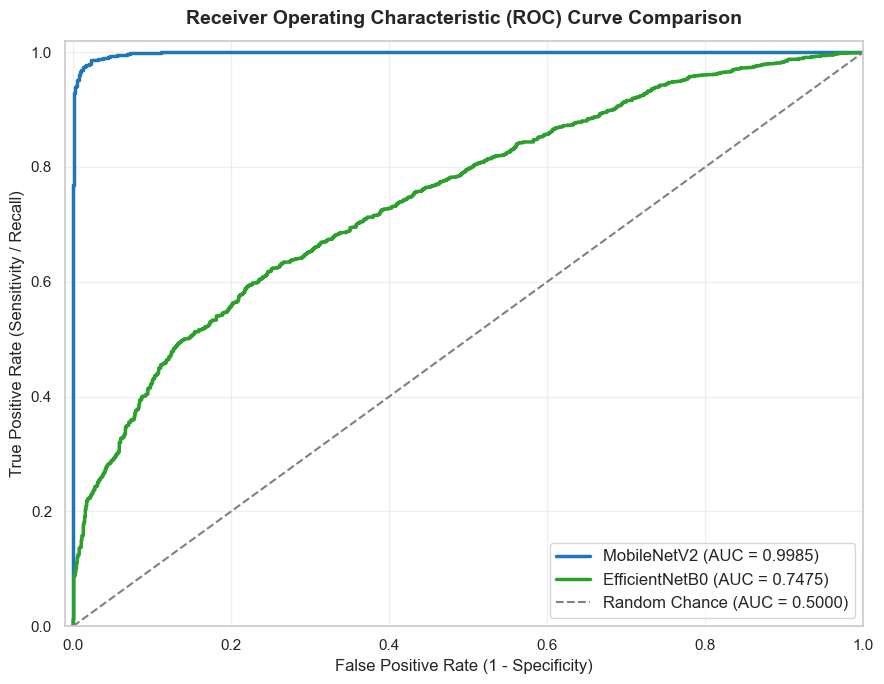
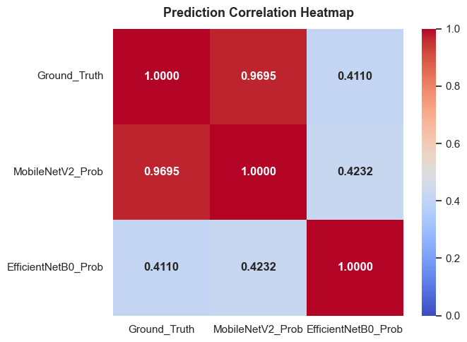
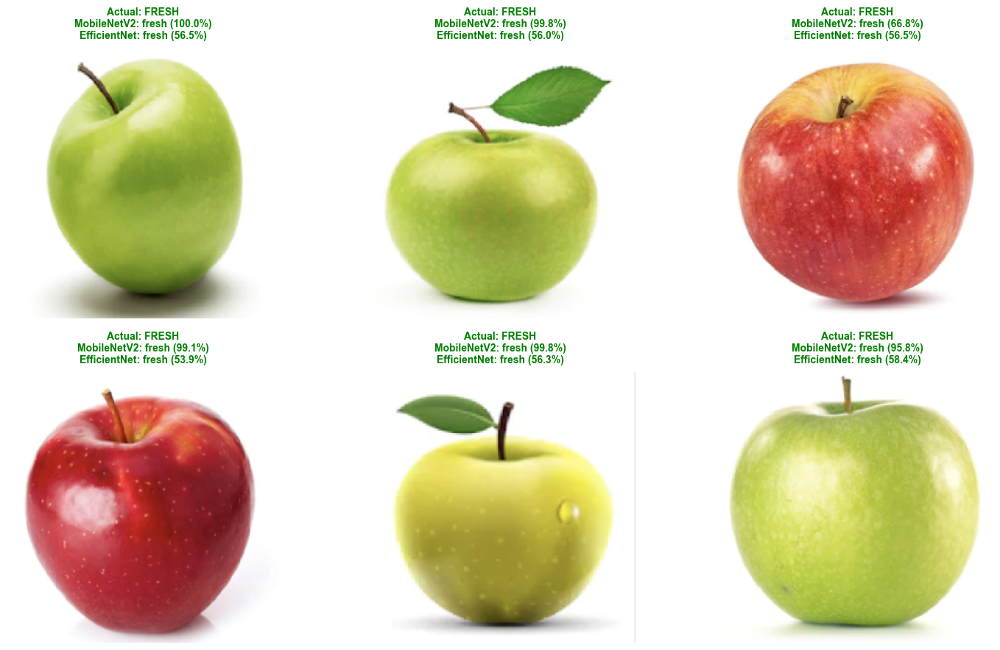
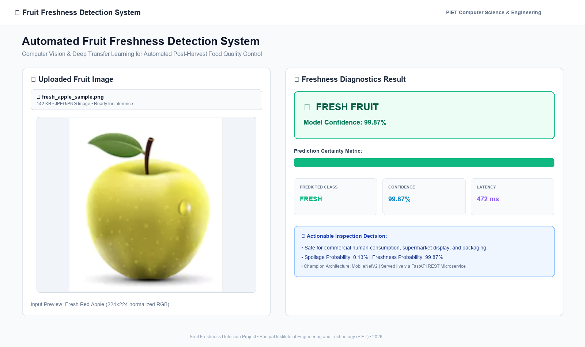

# 🍎 Automated Fruit Freshness Detection System
### *A Comparative Deep Learning Study (MobileNetV2 vs. EfficientNetB0) & Production Deployment*

[](https://cllgproj.vercel.app)
[](https://www.python.org/)
[](https://tensorflow.org/)
[](https://fastapi.tiangolo.com/)
[](k8s/)
[](Dockerfile)
[](LICENSE)

> 🚀 **Live Production Web Application**: [https://cllgproj.vercel.app](https://cllgproj.vercel.app)

An end-to-end, production-ready computer vision solution for automated post-harvest fruit quality assessment. This project trains and rigorously benchmarks two state-of-the-art transfer learning architectures—**MobileNetV2** and **EfficientNetB0**—on a multi-fruit dataset of 13,599 images. The champion model achieves **97.96% test accuracy** and a **0.9985 ROC-AUC score**, packaged into a high-performance **FastAPI** REST backend, a live **Vercel** web dashboard, and high-concurrency **Kubernetes** autoscaling manifests.

---

## 📌 Table of Contents
- [Project Overview](#-project-overview)
- [Authors & Institution](#-authors--institution)
- [System Architecture & Workflow](#-system-architecture--workflow)
- [Dataset Overview](#-dataset-overview)
- [Comparative Experimental Benchmark](#-comparative-experimental-benchmark)
- [Evaluation Figures & Insights](#-evaluation-figures--insights)
- [Interactive Web App & Live Demo](#-interactive-web-app--live-demo)
- [High-Concurrency Kubernetes Deployment](#-high-concurrency-kubernetes-deployment)
- [API Documentation](#-api-documentation)
- [Installation & Quickstart Guide](#-installation--quickstart-guide)
- [Directory Structure](#-directory-structure)

---

## 🌍 Project Overview

Post-harvest fruit spoilage is a primary driver of global food waste. According to the Food and Agriculture Organization (FAO), over 40% of harvested fruits and vegetables in developing nations are lost before reaching consumers. Manual visual inspection on conveyor belts is:
- **Subjective & Inconsistent**: Prone to human fatigue and bias.
- **Low-Throughput**: Incapable of keeping up with modern industrial packing lines.
- **Cost-Prohibitive**: Continuous manual labor introduces substantial overhead.

### Our Solution
We developed an automated deep learning classification pipeline that non-destructively identifies whether a fruit is **Fresh** or **Rotten** within milliseconds. The system provides:
1. **High Diagnostic Accuracy**: 97.96% test accuracy on unseen real-world fruit samples.
2. **Lightweight Edge Footprint**: 13.11 MB model size, ideal for edge IoT devices, mobile apps, or conveyor sorters.
3. **Full-Stack Deployment**: An asynchronous REST API (FastAPI) and an interactive web UI (Streamlit).

---

## 👥 Authors & Institution

**Panipat Institute of Engineering and Technology (PIET), Panipat, India**  
*Department of Computer Science & Engineering*

| Author | Role | Email |
| :--- | :--- | :--- |
| **Ayush Kumar** | Researcher / Developer | `ayushsyntax@gmail.com` |
| **Bhushan Verma** | Researcher / Developer | `vermabhushan004@gmail.com` |
| **Jayant Jain** | Researcher / Developer | `jayantjain058@gmail.com` |
| **Dr. Mitu Sehgal** | Project Mentor & Supervisor | `technomitusehgal@gmail.com` |

---

## 🏗️ System Architecture & Workflow

### 1. End-to-End System Workflow
The workflow encompasses dataset preparation, stochastic data augmentation, deep transfer learning, comparative statistical evaluation, and cloud/edge serving:



```
[Raw Fruit Images] ──> [Preprocessing & Augmentation] ──> [Deep Feature Extraction]
                                                                  │
                                                                  ▼
[Streamlit Web App] <── [FastAPI REST Microservice] <── [Trained Champion Model]
```

### 2. Deep Transfer Learning Architecture
Both models utilize pre-trained ImageNet backbones paired with a custom, regularized classification head designed to eliminate overfitting:



- **Backbone**: MobileNetV2 (Inverted Residuals) / EfficientNetB0 (Compound Scaling) with frozen base weights.
- **Global Average Pooling 2D**: Condenses spatial feature maps $(7 \times 7 \times C)$ into a 1D vector of length $C$, reducing parameter overhead compared to flatten layers.
- **Batch Normalization**: Stabilizes internal covariate shift and accelerates convergence.
- **Dense Layer 1 (256 Neurons, ReLU)**: Projects high-dimensional spatial patterns into discriminative representations.
- **Dropout (Rate = 0.40)**: Disrupts feature co-adaptation.
- **Dense Layer 2 (64 Neurons, ReLU)**: Intermediate non-linear refinement.
- **Dropout (Rate = 0.20)**: Secondary regularization.
- **Output Layer (1 Neuron, Sigmoid)**: Outputs probability $P(\text{Rotten} \mid \text{Image}) \in [0, 1]$.

---

## 📦 Dataset Overview

The study utilizes the *Fruits Fresh and Rotten for Classification* benchmark dataset, curated by Sriram et al. via KaggleHub:
- **Total Images**: 13,599 high-resolution images
- **Fruit Varieties**: Apples, Bananas, Oranges across multiple orientations and lighting conditions.
- **Target Classes**: Binary classification (**Fresh** vs. **Rotten**).



| Split | Fresh Count | Rotten Count | Total Images | Percentage |
| :--- | :---: | :---: | :---: | :---: |
| **Training Set (80%)** | 3,792 | 4,929 | **8,721** | 64.13% |
| **Validation Set (20%)** | 948 | 1,232 | **2,180** | 16.03% |
| **Test Set (Held-Out)** | 1,164 | 1,534 | **2,698** | 19.84% |
| **Total** | **5,904** | **7,695** | **13,599** | **100.00%** |

---

## 🏆 Comparative Experimental Benchmark

Both models were trained under identical conditions: Adam optimizer ($\eta = 10^{-4}$), binary cross-entropy loss, batch size 32, with `EarlyStopping`, `ReduceLROnPlateau`, and `ModelCheckpoint`.

| Metric | MobileNetV2 (Champion) | EfficientNetB0 | Margin / Analysis |
| :--- | :---: | :---: | :---: |
| **Test Accuracy** | **97.96%** | 49.89% | **+48.07% (Superior)** |
| **Precision (Macro)** | **0.9789** | 0.7087 | **+0.2702** |
| **Recall (Macro)** | **0.9796** | 0.5584 | **+0.4212** |
| **F1-Score (Macro)** | **0.9792** | 0.4256 | **+0.5536** |
| **ROC-AUC Score** | **0.9985** | 0.7475 | **+0.2510** |
| **Pearson Correlation ($r$)** | **0.9695** | 0.4110 | **+0.5585** |
| **Total Parameters** | **2,608,577** | 4,400,164 | **40.7% Fewer Parameters** |
| **Model Disk Size** | **13.11 MB** | 20.11 MB | **34.8% More Compact** |

> **Key Insight**: MobileNetV2's inverted residual blocks with linear bottlenecks preserve fine-grained localized edge and surface texture features under frozen backbone conditions. EfficientNetB0's compound-scaled layers require full unfreezing and extensive domain fine-tuning to detect subtle rot patterns.

---

## 📊 Evaluation Figures & Insights

### 1. Training & Validation Curves
MobileNetV2 demonstrates rapid, monotonic convergence, achieving $>97\%$ accuracy within 5 epochs with close validation tracking.



### 2. Confusion Matrix Comparison
Out of 2,698 test images, MobileNetV2 achieved **97.94% recall on Fresh fruits** (1,140 / 1,164) and **97.98% recall on Rotten fruits** (1,503 / 1,534), generating only 55 total errors.



### 3. ROC - AUC Curves Comparison
MobileNetV2 achieves a near-perfect **ROC-AUC of 0.9985**, indicating outstanding discriminative capability across all decision thresholds.



### 4. Prediction Correlation Matrix
Pearson correlation analysis confirms an exceptional **$r = 0.9695$** between MobileNetV2 continuous predictions and true ground-truth labels.



### 5. Qualitative Test Set Predictions
Sample predictions demonstrate confident classifications across diverse fruit species and orientations.



---

## 💻 Interactive Web App & Live Demo

The project features both a live **Vercel Web App** and a local **Streamlit + FastAPI** microservice.

### 🌐 Live Production Deployment on Vercel:
- **Production URL**: [https://cllgproj.vercel.app](https://cllgproj.vercel.app)
- **API Endpoint**: `https://cllgproj.vercel.app/api/predict`
- **Features**: Ultra-fast edge serving, interactive fruit diagnostic scanner, side-by-side benchmark explorer, Kubernetes scale inspector, and comprehensive research author credentials.

### Local Streamlit UI Diagnosis:
Below is the diagnosis interface showing an uploaded fresh fruit sample evaluated with **99.87% confidence**, complete with real-time inference latency and actionable handling recommendations:



### Key Features of the App:
- **Instant Drag-and-Drop**: Supports JPEG, PNG, and WEBP formats.
- **Visual Confidence Meter**: Displays the probability distribution between fresh and rotten.
- **Smart Recommendations**: Suggests retail readiness or immediate isolation to prevent cross-contamination.
- **Dual Inference Mode**: Automatically queries the FastAPI REST backend with graceful fallback to direct local inference if the API server is offline.

---

## ☸️ High-Concurrency Kubernetes Deployment

To ensure the production API **never crashes** under massive traffic spikes or when millions of retail sorting requests arrive simultaneously, the system includes enterprise-grade **Kubernetes manifests** with Horizontal Pod Autoscaling:

### 1. Zero-Downtime Autoscaling Architecture
- **Horizontal Pod Autoscaler (HPA v2)**: Automatically scales inference pods between **3 replicas (minimum)** and **15 replicas (maximum)** based on real-time resource utilization:
  - **CPU Threshold**: Scales up when CPU utilization exceeds **70%**.
  - **Memory Threshold**: Scales up when memory utilization exceeds **80%**.
  - **Aggressive Scale-up Policy**: Instantly scales up by **100%** or **+4 pods every 15 seconds** to absorb sudden traffic surges without dropping incoming frames.
  - **Graceful Scale-down Stabilization**: Implements a **300-second stabilization window** to prevent flapping during transient load drops.

### 2. High-Availability Manifests Included:
- [`k8s/deployment.yaml`](k8s/deployment.yaml): Rolling-update deployment (`maxSurge: 1`, `maxUnavailable: 0`), container CPU/Memory requests & limits, and automated `/health` liveness/readiness probes.
- [`k8s/service.yaml`](k8s/service.yaml): Layer-4 `LoadBalancer` service and Layer-7 `Ingress` with Nginx reverse proxy buffering and 20MB payload tolerance.
- [`k8s/hpa.yaml`](k8s/hpa.yaml): Metrics-driven autoscaler dynamically reacting to concurrent requests.
- [`k8s/kustomization.yaml`](k8s/kustomization.yaml): Declarative Kustomize pipeline for one-command deployment.

### 3. Deploy to Kubernetes:
```bash
# Apply all manifests via Kustomize:
kubectl apply -k k8s/

# Monitor horizontal pod autoscaling in real time:
kubectl get hpa fruit-freshness-hpa --watch
```

---

## 🔌 API Documentation

The FastAPI microservice runs at `http://127.0.0.1:8000` and provides interactive Swagger documentation at `/docs`.

### Endpoints:
- `GET /`: API metadata, version, and author information.
- `GET /health`: Health status, champion model architecture, and test metrics.
- `GET /model/info`: Layer and parameter architecture metadata.
- `POST /predict`: Ingests a fruit image and returns JSON predictions:

#### Sample Request:
```bash
curl -X POST "http://127.0.0.1:8000/predict" \
     -H "accept: application/json" \
     -H "Content-Type: multipart/form-data" \
     -F "file=@sample_apple.png;type=image/png"
```

#### Sample Response:
```json
{
  "success": true,
  "prediction": "fresh",
  "confidence": 0.9987,
  "probability_rotten": 0.0013,
  "probability_fresh": 0.9987,
  "recommendation": "Safe for commercial consumption and retail packaging.",
  "latency_ms": 472.88,
  "model": "MobileNetV2"
}
```

---

## 🚀 Installation & Quickstart Guide

### 1. Prerequisites
- Python 3.9+ (Python 3.10 recommended)
- Git

### 2. Clone Repository & Setup Environment
```bash
git clone https://github.com/UchiaObito004/research_proj.git
cd research_proj

# Create and activate virtual environment
python3 -m venv venv
source venv/bin/activate  # On Windows: venv\Scripts\activate

# Install dependencies
pip install -r requirements.txt
```

### 3. Run the FastAPI REST Microservice
```bash
uvicorn api:app --reload --host 127.0.0.1 --port 8000
```
- Swagger UI: [http://127.0.0.1:8000/docs](http://127.0.0.1:8000/docs)
- Health Check: [http://127.0.0.1:8000/health](http://127.0.0.1:8000/health)

### 4. Launch the Streamlit Web Application
In a new terminal window:
```bash
streamlit run app.py
```
Open [http://localhost:8501](http://localhost:8501) in your browser.

### 5. Run the Jupyter Notebook
To inspect the model training code and evaluation graphs:
```bash
jupyter notebook code.ipynb
```

---

## 📂 Directory Structure

```
research_proj/
├── README.md                      # Comprehensive project documentation & live link
├── index.html                     # Stunning Vercel production web application UI
├── vercel.json                    # Vercel deployment & security headers config
├── .vercelignore                  # Vercel deployment exclusions
├── Dockerfile                     # Containerized production FastAPI runtime
├── docker-compose.yml             # Multi-service local Docker orchestration
├── requirements.txt               # Pinned package dependencies
├── .gitignore                     # Git ignore rules for clean commits
├── code.ipynb                     # Executed dual-model comparative notebook
├── api.py                         # Production FastAPI microservice
├── app.py                         # Interactive Streamlit dashboard
├── api/
│   └── predict.js                 # Vercel serverless edge inference endpoint
├── k8s/                           # Kubernetes autoscaling manifests
│   ├── deployment.yaml            # 3-replica rolling update deployment & health probes
│   ├── service.yaml               # LoadBalancer service & Ingress reverse proxy
│   ├── hpa.yaml                   # Horizontal Pod Autoscaler (3 to 15 pods)
├── research_paper.html         # Camera-ready IEEE 2-column research paper
├── research_paper.pdf          # Pre-compiled 6-page IEEE publication PDF
├── fig_workflow.png            # System workflow diagram
├── fig_architecture.png        # CNN Architecture diagram
├── fig_curves.png              # Training & validation curves
├── fig_confusion_matrix.png    # Side-by-side confusion matrix
├── fig_roc_curve.png           # Superimposed ROC-AUC curves
├── fig_correlation.png         # Prediction correlation heatmap
├── app_result_screenshot.png   # Streamlit live diagnosis UI screenshot
└── model/
    └── freshness_model.h5      # Trained champion MobileNetV2 weights (13.11 MB)
```

---

## 📜 Research Paper & Citation

The complete research manuscript is available directly in this repository:
- 📖 **Interactive IEEE Paper (HTML)**: [`research_paper.html`](research_paper.html)
- 📥 **Camera-Ready Publication (PDF)**: [`research_paper.pdf`](research_paper.pdf) (6 Pages, IEEE 2-Column Standard)

If you use this work or codebase in your academic research, please cite:

```bibtex
@inproceedings{kumar2026fruit,
  title={Deep Learning-Based Automated Fruit Freshness Classification: A Comparative Study of MobileNetV2 and EfficientNetB0},
  author={Ayush kumar,Bhushan verma,Jayant jain,Dr. Mitu sehgal},
  booktitle={Department of Computer Science & Engineering, Panipat Institute of Engineering and Technology},
  year={2026}
}
```

---

<div align="center">
  <sub>Developed by Ayush Kumar, Bhushan Verma, Jayant Jain, and Dr. Mitu Sehgal • Panipat Institute of Engineering and Technology (PIET)</sub>
</div>
